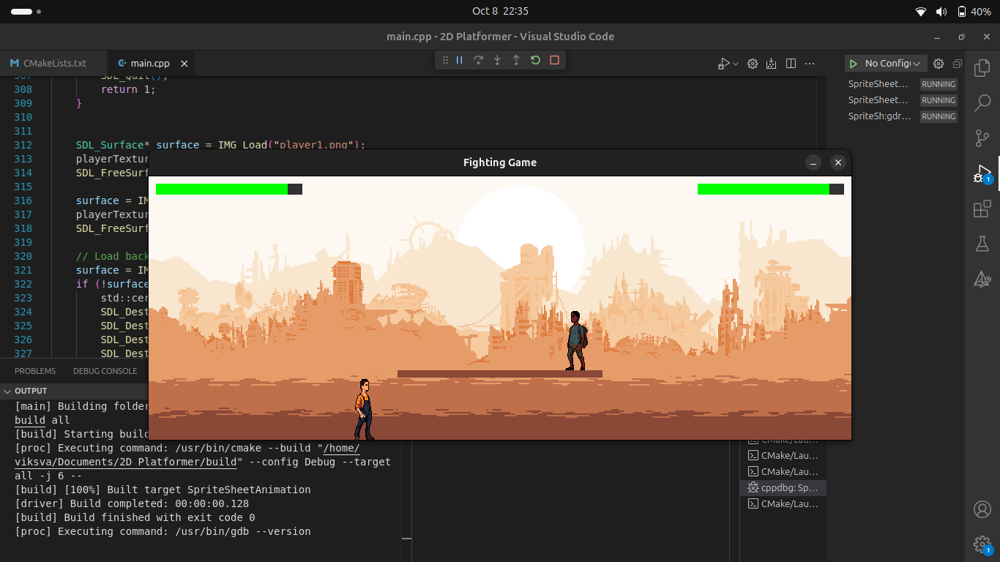

# 2D-SDL-Fighter-Game





This is a simple two-player 2D fighter game developed using SDL (Simple DirectMedia Layer) and SDL_image. It’s a beginner-friendly project that demonstrates basic game development concepts like graphics, input handling, and game logic. It still needs a lot of improving but I'm happy with it. 

## Features

- Two-player gameplay
- Basic character movement and combat
- Simple graphics with SDL and SDL_image

## Prerequisites

You need the following installed on your Ubuntu system:

- **CMake**
- **SDL2**
- **SDL2_image**

Install them using:

```bash
sudo apt-get update
sudo apt-get install cmake libsdl2-dev libsdl2-image-dev

```
### Notes:
`[CraftPix]([https://link-to-sprite-source](https://craftpix.net/freebies/city-man-pixel-art-character-sprite-sheets/))`

